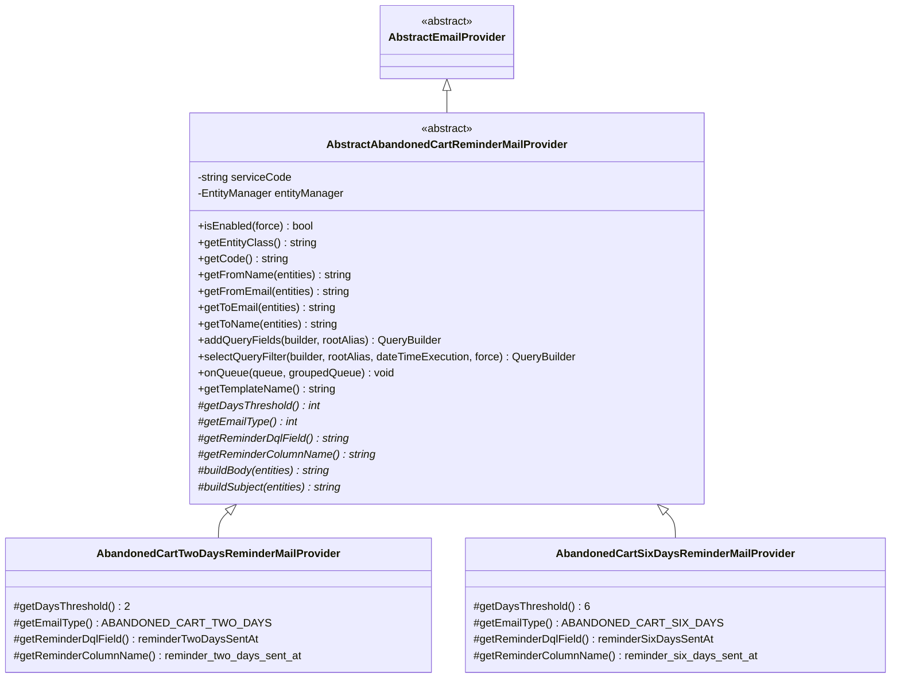
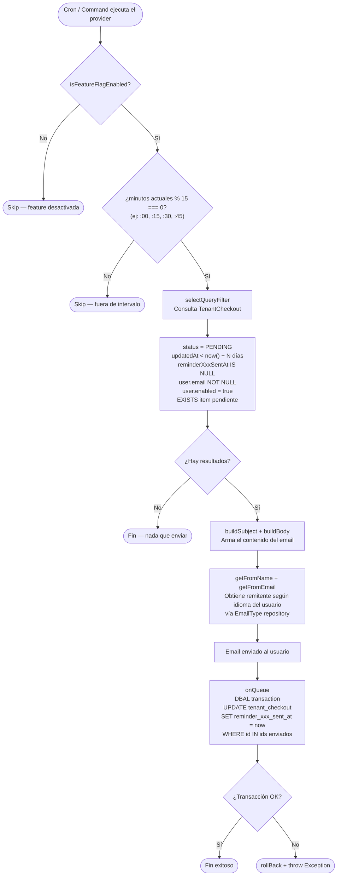
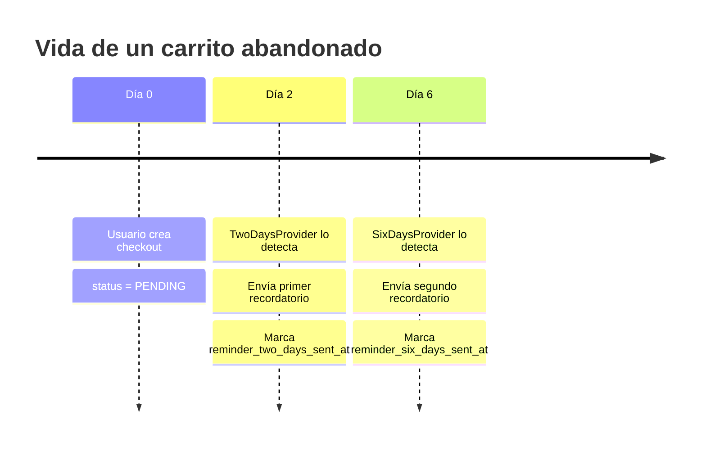

# Carrito Abandonado — Prototipo

Sistema de recordatorios por email para carritos abandonados. Envía correos automáticos a usuarios que dejaron un checkout en estado pendiente, en dos ventanas de tiempo distintas.

---

## Propuesta

Patrón **Template Method**: el abstract define el algoritmo completo de consulta, filtrado y marcado. Los providers concretos solo inyectan los valores que los diferencian (días de espera, tipo de email, columna de marca).

Esto permite agregar nuevos recordatorios (ej: 14 días) sin tocar la lógica central.

---

## Jerarquía de clases



---

## Flujo de envío



---

## Línea de tiempo por checkout



---

## Diferencias entre los dos providers

| | `TwoDaysReminderMailProvider` | `SixDaysReminderMailProvider` |
|---|---|---|
| Días de espera | 2 | 6 |
| Campo DQL | `reminderTwoDaysSentAt` | `reminderSixDaysSentAt` |
| Columna DB | `reminder_two_days_sent_at` | `reminder_six_days_sent_at` |
| Tipo de email | `ABANDONED_CART_TWO_DAYS` | `ABANDONED_CART_SIX_DAYS` |

Ambos providers implementan exactamente los mismos métodos abstractos. La lógica de consulta, envío y marcado es 100% heredada del abstract.

---

## Métodos abstractos que cada provider debe implementar

```
getDaysThreshold()       → cuántos días deben haber pasado desde updatedAt
getEmailType()           → constante de Tenant para obtener config de email
getReminderDqlField()    → campo DQL para filtrar "aún no enviado"
getReminderColumnName()  → columna SQL para marcar "ya enviado"
buildBody()              → HTML/texto del cuerpo del email
buildSubject()           → asunto del email
```

---

## Garantía de no duplicados

El filtro `reminderXxxSentAt IS NULL` + el `UPDATE` en `onQueue()` forman una guarda idempotente: un checkout que ya recibió su recordatorio de 2 días nunca vuelve a aparecer en la consulta de 2 días. Los recordatorios de 2 días y 6 días son independientes entre sí.
